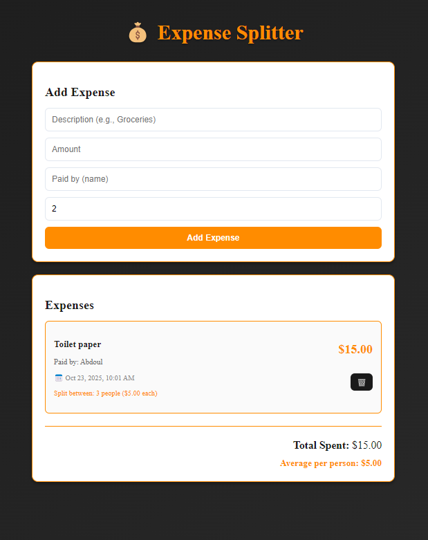

# 💰 Expense Splitter

**Live Demo:** [https://expense-splitter-yje9.vercel.app/](https://expense-splitter-yje9.vercel.app/)

A real-time expense tracking and splitting application built for college roommates who want to easily manage shared expenses like toilet paper, WiFi bills, groceries, cleaning supplies, and utilities; costs that usually one person pays upfront and others reimburse later. Track who paid for what, calculate fair splits, and keep everyone accountable without the awkward money conversations.

##📝 Features

- **Add Expenses**: Record expenses with description, amount, payer name, and number of people splitting
- **Real-time Updates**: All expenses sync instantly using Supabase real-time subscriptions
- **Automatic Calculations**: 
  - Calculate per-person cost for each expense
  - Display total spending across all expenses
  - Show average cost per person
- **Delete Expenses**: Remove expenses with a single click
- **Timestamp Tracking**: Every expense is logged with date and time
- **Responsive Design**: Works seamlessly on desktop and mobile devices

## 🛠️ Tech Stack

- **Frontend**: React 19 with Vite
- **Backend**: Supabase (PostgreSQL database + real-time subscriptions)
- **Styling**: Tailwind CSS with custom design
- **Deployment**: Vercel
- **Version Control**: Git & GitHub

## 📶 Key Metrics

- **Real-time sync**: <100ms latency for expense updates
- **Fully responsive**: Mobile-first design approach
- **Production-ready**: Deployed with CI/CD pipeline via Vercel

## Use Cases

- **College Roommates**: Track who bought toilet paper, paid the WiFi bill, or restocked cleaning supplies
- **Shared Groceries**: Split the cost of milk, eggs, and other pantry staples fairly
- **Utility Bills**: Keep track of electricity, water, and internet payments when one person's name is on the account
- **Household Supplies**: Monitor who paid for dish soap, paper towels, laundry detergent, and other essentials
- **Group Meals**: Record who ordered takeout or bought ingredients for shared dinners

## 👨🏻‍💻 Technical Highlights

### Database Design
- Efficient schema with `expenses` table storing all transaction data
- Real-time subscriptions for instant UI updates across all connected clients
- Automatic timestamp generation using Supabase's `created_at` field

### State Management
- React hooks (`useState`, `useEffect`) for clean, functional component architecture
- Asynchronous data fetching with error handling
- Optimistic UI updates for smooth user experience

### Calculations
- Dynamic per-person cost calculation based on split count
- Aggregate functions for total spending and average per person
- Handles edge cases (division by zero, missing data)

## Getting Started

### Prerequisites
- Node.js (v18 or higher)
- npm or yarn
- Supabase account

### Installation

1. Clone the repository:
```bash
git clone https://github.com/abdoulousseini2028-droid/expense-splitter.git
cd expense-splitter
```

2. Install dependencies:
```bash
npm install
```

3. Set up Supabase:
   - Create a new project at [supabase.com](https://supabase.com)
   - Create an `expenses` table with the following schema:
     ```sql
     CREATE TABLE expenses (
       id BIGSERIAL PRIMARY KEY,
       description TEXT NOT NULL,
       amount DECIMAL(10,2) NOT NULL,
       paid_by TEXT NOT NULL,
       split_between INTEGER NOT NULL DEFAULT 1,
       created_at TIMESTAMPTZ DEFAULT NOW()
     );
     ```
   - Get your project URL and anon key from Settings > API

4. Create a `supabaseClient.js` file in the `src/` directory:
```javascript
import { createClient } from '@supabase/supabase-js'

const supabaseUrl = 'YOUR_SUPABASE_URL'
const supabaseAnonKey = 'YOUR_SUPABASE_ANON_KEY'

export const supabase = createClient(supabaseUrl, supabaseAnonKey)
```

5. Run the development server:
```bash
npm run dev
```

6. Open [http://localhost:5173](http://localhost:5173) in your browser

## 📱 Screenshot



*Add expenses and view real-time splitting calculations*

## 🔮 Future Enhancements

- [ ] User authentication for private expense groups
- [ ] Export data to CSV/PDF
- [ ] Expense categories and filtering
- [ ] Payment reminders and notifications
- [ ] Debt settlement recommendations (who owes whom)
- [ ] Charts and spending analytics
- [ ] Payment integration (Venmo, PayPal)

## 📝 Learning Outcomes

This project demonstrates proficiency in:
- Full-stack development with modern React patterns
- Real-time database integration and subscriptions
- RESTful API consumption and error handling
- Responsive UI/UX design principles
- Production deployment and CI/CD workflows
- Git version control and collaboration

## 🤝 Contributing

Contributions, issues, and feature requests are welcome! Feel free to check the [issues page](https://github.com/abdoulousseini2028-droid/expense-splitter/issues).

## 📄 License

This project is open source and available under the [MIT License](LICENSE).

## 👤 Author

**Abdoul Rahim Ousseini**
- GitHub: [@abdoulousseini2028-droid](https://github.com/abdoulousseini2028-droid)

---

⭐ Star this repo if you found it helpful!
